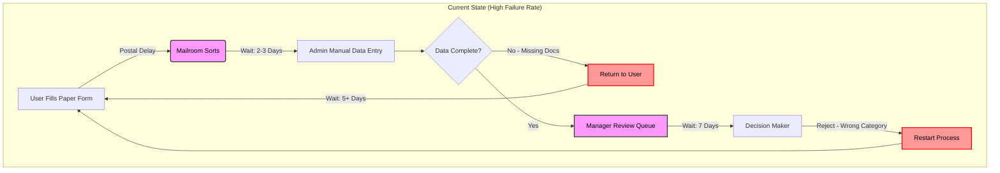

## AS-IS: Manual Intake Process
*Simulation based on common public sector "swivel chair" patterns*

### Observed Pain Points (To Validate with SMEs)
- **30% Rejection Rate**: Forms returned due to missing mandatory fields
- **Time Lag**: 2-week average from submission to first validation check  
- **No Early Feedback**: User only learns of errors days after submission
- **Category Mis-routing**: Simple cases queued behind complex ones

### Questions for Subject Matter Experts
1. What is the current "Right First Time" percentage in your service?
2. Which data fields cause 80% of rejections (the "critical few")?
3. Do users have channel choice (online/paper/phone), or is this mandated?
