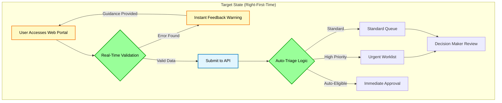

## TO-BE: Smart Intake Pattern
*Proposed validation-at-source workflow*

### Key Improvements
- **Immediate Validation**: Client-side and server-side checks prevent submission of incomplete data
- **Triage Logic**: High-risk/complex cases fast-tracked; simple cases automated  
- **Audit Trail**: Every validation failure logged for service improvement

### Technical Assumptions (To Confirm with Architects)
- API-first architecture (REST/JSON)
- Accessibility compliance (WCAG 2.1 AA)
- Data encryption in transit and at rest
