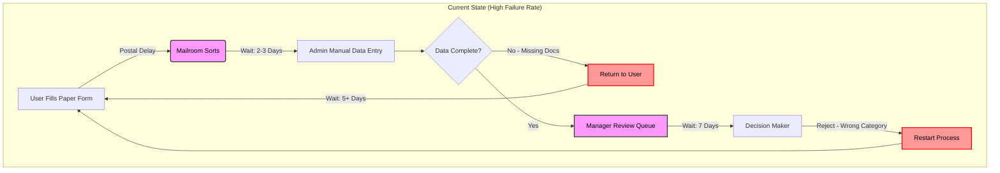
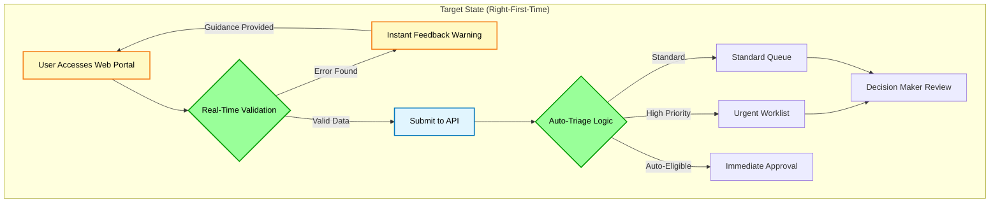

# The 'Right-First-Time' Intake Pattern
**Technical Business Analyst Portfolio | Public Sector Digital Optimisation**

## The Problem
In high-volume public sector intake (DWP benefits, NHS referrals, Local Government permits), 
30% of submissions fail initial validation due to missing or conflicting data. This creates 
"swivel chair" rework for caseworkers and delays for citizens.

## The Solution
A **Smart Intake** workflow that validates evidence before it reaches the decision-maker, 
while maintaining public sector standards (accessibility, audit, GDPR).

---

## 📂 Portfolio Artefacts (Click to View)

### 1. Process Analysis
Visualising current pain points and proposed optimisation.

- [AS-IS: Manual Triage Process](./1-process-maps/as-is-manual-triage.md)  
  *Current state with 30% rejection rate, postal delays, and "swivel chair" inefficiencies*

- [TO-BE: Smart Intake Pattern](./1-process-maps/to-be-smart-intake.md)  
  *Target state with real-time validation, auto-triage, and API-first architecture*

### 2. Requirements Engineering
Behaviour-Driven Development specifications.

- [Intake Validation Scenarios](./2-user-stories/intake-validation.feature)  
  *Gherkin feature file including accessibility compliance (WCAG 2.1 AA) and validation logic*

### 3. Data Specifications
Technical implementation details for developer handoff.

- [Submission Payload Schema](./3-data-specs/submission-payload.json)  
  *JSON schema with PII handling, validation rules, and data retention policies*

### 4. Governance & Compliance
Public sector risk management.

- [Data Sensitivity Assessment](./4-governance/data-sensitivity-assessment.md)  
  *GDPR Article 9 considerations, audit trails, and bias mitigation for auto-triage*
  
- [Accessibility Checklist](./4-governance/accessibility-checklist.md)  
  *WCAG 2.1 AA compliance criteria aligned with GDS Service Standards*

### 5. Discovery & Learning
Stakeholder engagement preparation.

- [Questions for Stakeholders](./5-learning/questions-for-stakeholders.md)  
  *Top 10 discovery questions for SMEs, service users, and delivery teams (to be validated)*

### 6. Performance Analysis & Measurement
Demonstrating DWP Digital-style data-driven service improvement.

- [KPI Framework & SQL Queries](./6-performance-analysis/intake_kpi_framework.md)  
  *BigQuery SQL for Right-First-Time monitoring and cost-per-transaction analysis*
  
- [Dashboard Specification](./6-performance-analysis/dashboard_specification.md)  
  *Looker Studio design for real-time service performance visibility*
  
- [A/B Test Methodology](./6-performance-analysis/ab_test_methodology.md)  
  *Experimental design to validate Smart Intake impact with statistical rigour*
---

## 🎯 Domain Context (Examples Only)
This pattern is domain-agnostic. Specific applications would include:
- **DWP**: UC claim evidence validation (bank statement format checks)
- **NHS**: Referral completeness (mandatory clinical attachments)
- **Local Gov**: Planning permission pre-checks (mandatory documents)

*Domain-specific policy rules would be elaborated with Subject Matter Experts during discovery.*

## 📄 Licence & Disclaimer
**Licence**: [MIT License](./LICENSE) - See LICENSE file for details.

**Disclaimer**: This is an **educational simulation** created by an individual BA candidate. 
- No real personal data or proprietary government systems are included
- Based on publicly available GDS standards and NAO reports
- Not affiliated with NHS England, DWP, or any government body
